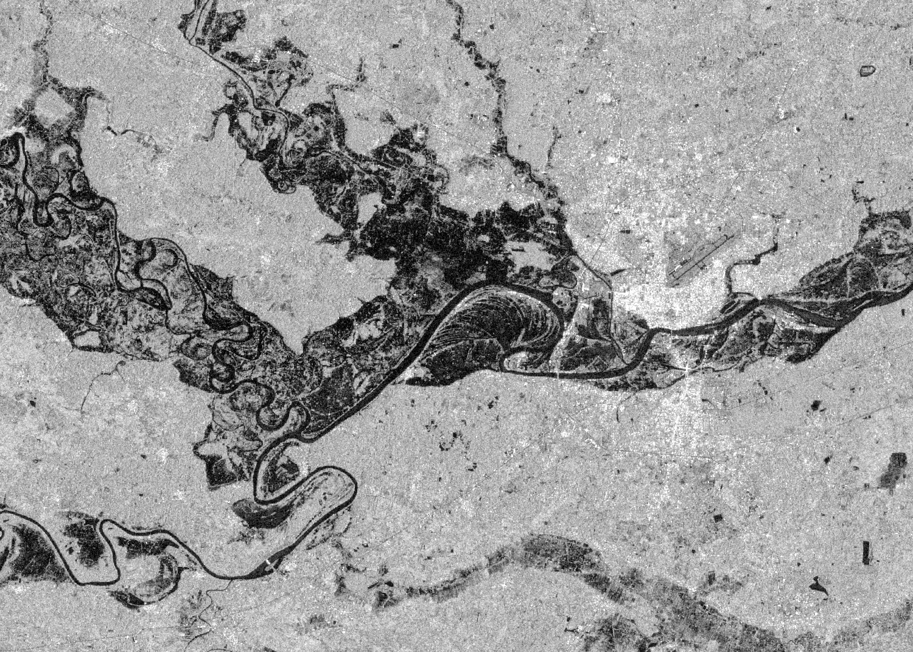
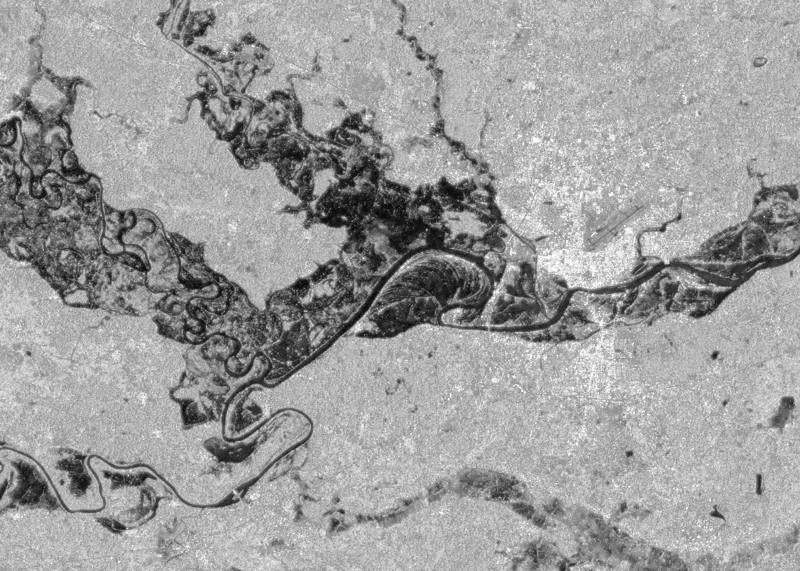
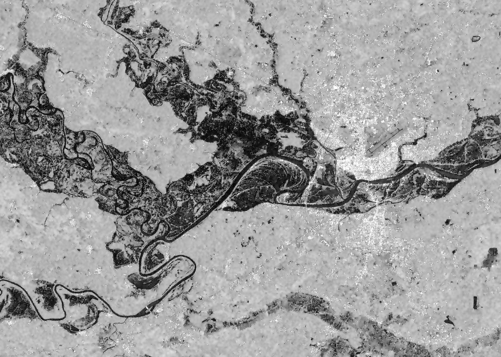

Here are a more in depth examples of specific algorithms for surface water mapping workflows that are implemented within `hydrafloods` that users can call. It is expected that the code is run in an interactive python session such as IPython or in a Jupyter Notebook as later code blocks will use variables from previous ones.

```python
import ee
ee.Initialize()
import hydrafloods as hf
```

## SAR Speckle Filtering Algorithms

SAR imagery is affected by artifacts called Speckle. Speckle looks like  granular noise in synthetic aperture radar (SAR) data and is due to the interference of radar waves reflected from many elementary scatterers on the ground. Speckle in SAR imagery typically reduces the accuracy of image segmentation and classification so applying speckle filters is a common preprocessing step ([Lee et al., 2009](https://doi.org/10.1080/02757259409532206)). Multiple algorithms have been developed by the scientific community to alleviate the effects of Speckle in subsequent SAR image processing.

`hydrafloods` has implemented a few of these Speckle filter algorithms in the package to help effectively use SAR imagery for image processing, in this case for surface water mapping. Here is a list of Speckle filter algorithms available:

 - Lee Sigma: [`hydrafloods.lee_sigma`](/filtering/#hydrafloods.filtering.lee_sigma) ([Lee et al., 2008](https://doi.org/10.1109/TGRS.2008.2002881))
 - Gamma Map: [`hydrafloods.gamma_map`](/filtering/#hydrafloods.filtering.gamma_map) ([Beauchemin et al., 1995](https://doi.org/10.1080/01431169608949067))
 - Refined Lee: [`hydrafloods.refined_lee`](/filtering/#hydrafloods.filtering.refined_lee) ([Lee, 1981](https://doi.org/10.1016/S0146-664X(81)80018-4))

 Here is a brief example of how one might apply these algorithms to SAR data using `hydrafloods`:

```python
# define a geographic region
region = hf.country_bbox("Cambodia")

# define start and end times
start_time = "2019-09-15"
end_time = "2019-09-20"

# get the Sentinel 1 collection as a Dataset
s1 = hf.Sentinel1(region,start_time,end_time)
```

After we have our SAR collection, we can apply the functions on the image using the `apply_func()` method. Since these algorithms take an image as input and ouput and image we can easily apply on all imagery. Watch out though...some of these algorithms (specfically `refined_lee()`) are extremely memory intensive and you will likely get a "User memory limit exceeded" error when applying over many (25+) images. In this case, it will work since we are only applying over a few images.

```python

lee_sigma_filtered = (
    s1.apply_func(hf.lee_sigma)
    .collection.first()
)

gamma_map_filtered = (
    s1.apply_func(hf.gamma_map)
    .collection.first()
)
refined_lee_filtered = (
    s1.apply_func(hf.refined_lee)
    .collection.first()
)

original = s1.collection.first()

zoom_region = [104.60, 15.10, 104.95, 15.35]
viz_params = {
    "min":-25,
    "max":0,
    "bands":"VV",
    "region":zoom_region,
    "dimensions":2000,
    "crs":"epsg:4326"
}

print(original.getThumbURL(viz_params))
print(lee_sigma_filtered.getThumbURL(viz_params))
print(gamma_map_filtered.getThumbURL(viz_params))
print(refined_lee_filtered.getThumbURL(viz_params))

```
<!-- html code for figure caption -->
<span class="img_caption" style="display: block; text-align: center; font-size: 14px; color: darkred;">
    *Try opening the examples in a new tab to zoom in and really see the differences*
</span>

 Original                        | Lee Sigma filter
:-------------------------------:|:-------------------------------:
 |  

 Gamma Map filter                | Refined Lee filter
:-------------------------------:|:-------------------------------:
 |  

For more information on the filtering algorithms and the specific arguments, please see the [filtering module](/filtering/) API reference


## Correction Algorithms

Another common workflow when working with satelitte imagery is to correct for atmospheric and terrain effects. Most of the data collection on Earth Engine have atmospherically corrected data so `hydrafloods` has focused on correction algorithms for terrain (both SAR and optical) correction and a bidirectional reflectance distribution function (BRDF) correction for optical imagery.

🚧 Under construction 🚧


## Generic Water Mapping Algorithms

The goal of `hydrafloods` is to provide efficient, easily accessible surface water maps. To that end, there are a few generic surface water mapping algorithms available that can be used with virtually any dataset (given some customization of parameters). Here is a list of the water mapping algorithms available:

- Edge Otsu: [`hydrafloods.edge_otsu`](/thresholding/#hydrafloods.thresholding.edge_otsu) ([Donchyts et al., 2016](https://doi.org/10.3390/rs8050386); [Markert et al., 2020](https://doi.org/10.3390/rs12152469))
- Bmax Otsu: [`hydrafloods.bmax_otsu`](/thresholding/#hydrafloods.thresholding.bmax_otsu) ([Cao et al.,2019](https://doi.org/10.3390/w11040786); [Markert et al., 2020](https://doi.org/10.3390/rs12152469))
- KMeans Extent: [`hydrafloods.kmeans_extent`](/thresholding/#hydrafloods.thresholding.kmeans_extent) ([Chang et al., 2020](https://doi.org/10.1016/j.rse.2020.111732))

To begin, we will access optical and SAR data for a coincident time period following the example from [Using Datasets](/using-datasets/):

```python
# area where overlap is known
region = ee.Geometry.Rectangle([103.6334, 12.4368, 104.8419, 13.2615])
# month where we know coincident data
start_time = "2019-02-01"
end_time = "2019-03-01"

# get Landsat 8 dataset
lc8 = hf.Landsat8(region,start_time,end_time)
# add the mndwi water index to the lc8 dataset
lc8 = lc8.apply_func(hf.add_indices,indices=["mndwi"])

# get Sentinel 1 dataset
s1 = hf.Sentinel1(region,start_time,end_time)
# apply gamma map speckle filter
s1 = s1.apply_func(hf.gamma_map)

# join the two datasets
joined = lc8.join(s1)

# create a composite image for the region
composite = joined.collection.median()

# define some visualization parameters to use
water_viz = {
    "min":0,
    "max":1,
    "palette":"silver,navy",
    "region":region,
    "dimensions":2000
}
optical_viz = {
    "min":50,
    "max":5500,
    "bands":"swir2,nir,green",
    "gamma":1.5,
    "region":region,
    "dimensions":2000
}
sar_viz = {
    "min":-25,
    "max":0,
    "bands":"VV",
    "region":region,
    "dimensions":2000
}
```

Now that we have our data here we will highlight how to use some generic surface water mapping algorithms, specifically the [`edge_otsu()`](/thresholding/#hydrafloods.thresholding.edge_otsu) algorithm:

```python
# apply the edge otsu algorithm on the MNDWI optical index
optical_water = hf.edge_otsu(
    composite,
    region=region,
    band="mndwi",
    initial_threshold=0,
    edge_buffer=300,
    invert=True
)
# apply edge otsu algorithm on the VV SAR band
sar_water = hf.edge_otsu(
    composite,
    region=region,
    band="VV",
    initial_threshold=-16,
    edge_buffer=300
)

# get thumb urls of results
print(composite.getThumbURL(optical_viz))
print(composite.getThumbURL(sar_viz))
print(optical_water.getThumbURL(water_viz))
print(sar_water.getThumbURL(water_viz))
```

 Landsat 8 Image                 | SAR Image
:-------------------------------:|:-------------------------------:
 |  

 Landsat 8 Water Map                  | SAR Water Map
:------------------------------------:|:---------------------------------:
 |  

This is just one example of surface water mapping and there are additional water mapping algorithms as mentioned above. More documentation regarding the water mapping functions and the input arguments can be found at the [thresholding module](/thresholding/)

If there are other algorithms you would like to see in the `hydrafloods` package, please file an [issue](https://github.com/Servir-Mekong/hydra-floods/issues) with specifics (and hopefully a link to the paper) on our GitHub repo.