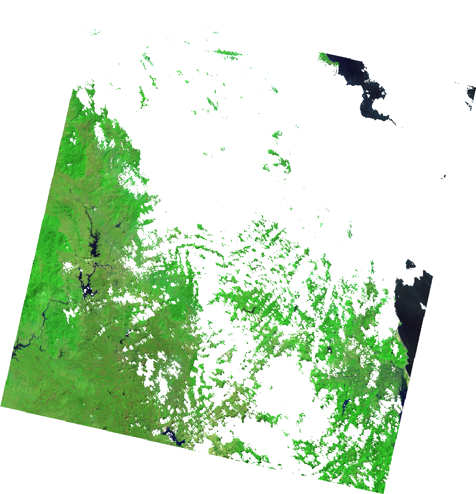
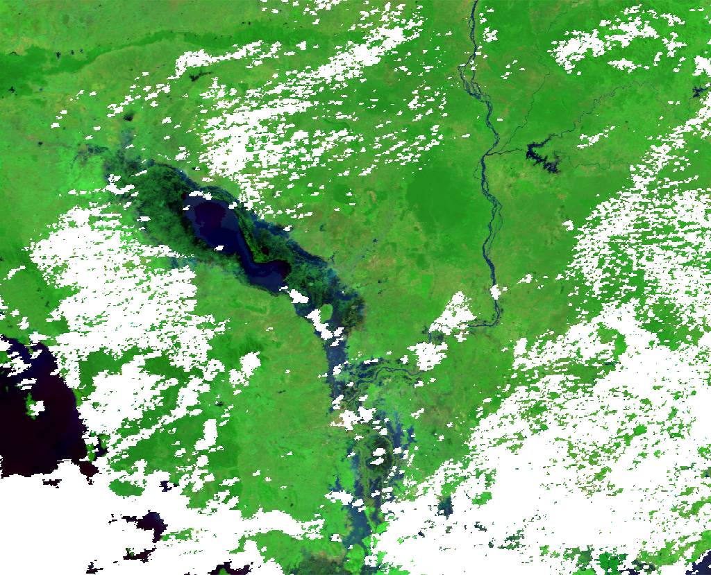

Here are a more in depth examples of using `hydrafloods.Dataset` classes for working with imagery. It is expected that the code is run in an interactive python session such as IPython or in a Jupyter Notebook as later code blocks will use variables from previous ones.

```python
import ee
ee.Initialze()
import hydrafloods as hf
```

## Dataset structure

```python
region = hf.country_bbox("Cambodia")
start_time = "2019-01-01"
end_time = "2019-07-01"

# get a Landsat 8 collection
lc8 = hf.Landsat8(region,start_time,end_time)
print(lc8)
# should look like 
# HYDRAFloods Dataset:
# {'asset_id': 'LANDSAT/LC08/C01/T1_SR',
#  'end_time': '2019-07-01',
#  'name': 'Landsat8',
#  'region': [[[...], [...], [...], [...], [...]]],
#  'start_time': '2019-01-01'}
```

A dataset object has a few properties that we can access to assist in processing or understanding the data contained in the dataset. Here is a list of properties and a description:

 - `Dataset.collection`: Earth Engine image collection object that the dataset class wraps
 - `Dataset.n_images`: client side number of images in collection
 - `Dataset.dates`: client side list of datetime information of all images acquisition times

Let's inspect some of these properties

```python
print(lc8.n_images)
# should equal 197

print(lc8.dates)
# should look something like 
# ['2019-01-12 03:06:42.950',
#  '2019-01-28 03:06:38.990',
#  ... ,
# '2019-06-01 03:32:06.850']

# since `Dataset.collection` is a server side object we will just
# check that it is in fact a ee.ImageCollection object
print(isinstance(lc8.collection, ee.ImageCollection))
# should == True
```

### Specialized Datasets

`hydrafloods` has specialized datasets classes that extend a `hydrafloods.Dataset` class and are common image collections used in surface water mapping. These specialized datasets include a custom `qa()` method that gets called on initialization to mask poor quality pixels and custom methods that make harmonization easy. Furthermore, the optical sensor bands are automatically renamed to a common scheme so that they can be used together easily. Here is a list of the specialized datasets with links to information on methods:

Really, one can think of the custom `qa()` method as a preprocessing step that you would like to happen on *all* images in the dataset so it is not just restricted to specific sensors as seen in a later section.

- Sentinel 1: [`hydrafloods.Sentinel1`](/datasets/#hydrafloods.datasets.Sentinel1)
- Sentinel 2: [`hydrafloods.Sentinel2`](/datasets/#hydrafloods.datasets.Sentinel2)
- Landsat 8: [`hydrafloods.Landsat8`](/datasets/#hydrafloods.datasets.Landsat8)
- Landsat 7: [`hydrafloods.Landsat7`](/datasets/#hydrafloods.datasets.Landsat7)
- VIIRS: [`hydrafloods.Viirs`](/datasets/#hydrafloods.datasets.Viirs)
- MODIS: [`hydrafloods.Modis`](/datasets/#hydrafloods.datasets.Modis)

To provide an example of using the internal `qa()` method and not we can redefine the Landsat 8 collection from before but with setting `use_qa` to `False`

```python
lc8 = hf.Landsat8(region,start_time,end_time)
lc8_noqa = hf.Landsat8(region,start_time,end_time,use_qa=False)

thumb_params = {
    "min":50,
    "max":5500,
    "bands":"swir2,nir,green",
    "gamma":1.5,
    "dimensions":1024
}

# get thumbnail images
qa_thumb = (
    lc8.collection.first()
    .getThumbURL(thumb_params)
)

noqa_thumb = (
    lc8_noqa.collection.first()
    .getThumbURL(thumb_params)
)

# print urls to view thumbnails
print(qa_thumb)
print(noqa_thumb)
```

`use_qa = True`             |  `use_qa = False` 
:-------------------------:|:-------------------------:
  |   

We can clearly see the image on the left has clouds and cloud shadows masked and can therefore be used directly in analysis with minimal effort. More information on the internals of these specialized datasets and how you can write your own can be found at the [Writing your own dataset class](#writing-your-own-dataset-class) section.

## Applying a function

## Merging Datasets

One of the simpilist ways to combine datasets is to merge. This takes the imagery in one collection and concatenates it with the original collection. We can use the [`merge()`](/datasets/#hydrafloods.datasets.Dataset.merge) method to accomplish this. Additioanlly, the `merge()` method automatically sorts the image collections in time so we can start using dense time series right away. Here is an example of merging Landat8 and Sentinel2 datasets together:

```python
lc8 = hf.Landsat8(region,start_time,end_time)
# has 197 image

s2 = hf.Sentinel2(region,start_time,end_time)
# has 2400 images

merged = lc8.merge(s2)
print(merged.n_images)
# now has 2597 images!
```

## Joining Datasets

Joining datasets is another way to bring together two datasets but by looking at coincident imagery and combines the bands into one image. Whereas merge combined the two collections irrespective of space time overlap, [`join()`](/datasets/#hydrafloods.datasets.Dataset.join) looks for overlapping data in space and time and will return only data that overlaps with the bands combined. Furthermore, the resulting images will be clipped to the overlapping region. This functionality is really helpful when looking for coincident data from multiple sensors.

```python
lc8 = hf.Landsat8(region,start_time,end_time)
# has 197 images

s1 = hf.Sentinel1(region,start_time,end_time)
# has 628 images

joined = lc8.join(s1)
# has 131 coincident images

# grab the first image in the collection
# will have optical and sar bands 
first = joined.collection.first()

print(first.bandNames().getInfo())
# should equal the following:
# ['blue', 'green', 'red', 'nir', 'swir1', 'swir2', 'VV', 'VH', 'angle']
# both optical and SAR bands are included in the image

# visualize the different bands
optical_thumb = first.getThumbURL({
    "min":50,
    "max":5500,
    "bands":"swir2,nir,green",
    "gamma":1.5,
    "dimensions":1024
})
sar_thumb = first.getThumbURL({
    "min":[-25,-30,-25],
    "max":[0,-5,0],
    "bands":"VV,VH,VV",
    "dimensions":1024
})

# print urls to view thumbnails
print(optical_thumb)
print(sar_thumb)
```

 Landsat 8 2019-01-28            | Sentinel 1 2019-01-28
:-------------------------------:|:-------------------------------:
 |  


## Temporal aggregation

A common workflow is merging data and make composites for individual dates that data is available. A good example of this is the MODIS sensor that is onboard the Terra and Aqua satellite. We can create daily composites of the imagery by merging the datasets then looping over each day to mosaic the data. `hydrafloods` has a method [`aggregate_time()`](/datasets/#hydrafloods.datasets.Dataset.aggregate_time) to do the mosiacing sequentially in time. Here we create a combined MODIS Terra and Aqua dataset.

```python
# define new time range
start_time = "2018-11-03"  
end_time = "2018-11-15" 

# get the terra MODIS dataset
terra = hf.Modis(region,start_time,end_time) 
# get the aqua MODIS dataset
# note calling the asset_id explicitly
aqua = hf.Modis(region,start_time,end_time,asset_id="MODIS/006/MYD09GA")

# merge the collections into one
merged = terra.merge(aqua)
# aggregate in time
agg = merged.aggregate_time(reducer="median")
```

MODIS Terra 2018-11-03            | MODIS Aqua 2018-11-03            | Aggregated
:--------------------------------:|:--------------------------------:|:------------------------------------:
 |  |  

By doing this we can fill in gaps where some data is missing with other sensors. We see in the above example that combining the MODIS data from Terra and Aqua we can get more coverage in the event of flooding. By default the method will take unique dates within the dataset and aggregate by one day as seen in the above example.

We can also use this functionality to make monthly or yearly composites of data by specifying the dates that we want to start the aggregation with and a period after the start dates to do the aggregation. Here is an example creating yearly composites from 2015 through 2019:

```python
# define new time range
start_time = "2015-01-01"  
end_time = "2020-01-01" 

# define the dates in which to start aggregation
year_starts = ["2015-01-01","2016-01-01","2017-01-01","2018-01-01","2019-01-01"]

# get the terra MODIS dataset
terra = hf.Modis(region,start_time,end_time) 
# apply the aggregation 
yearly = terra.aggregate_time(dates=year_starts,period=365)

print(yearly.dates)
# should equal to:
# ['2015-01-01 00:00:00.000',
#  '2016-01-01 00:00:00.000',
#  '2017-01-01 00:00:00.000',
#  '2018-01-01 00:00:00.000',
#  '2019-01-01 00:00:00.000']
```

As seen, this method allows for customization of when to start aggregations and how long/which dates to include in aggregation which can be helpful for unique timings like dekads.

## Writing your own dataset class

The `hydrafloods.Dataset` class can be used to create custom dataset classes for sensors. This is helpful when there is a sensor that will be used often with other datasets using `hydrafloods`. Here is an example of writing a custom `hydrafloods.Dataset` class for the GOES16 collection. We will predefine the `asset_id` argument and define a `qa()` method to scale data to reflectance and mask poor quality pixels.

```python
class Goes16(hf.Dataset):
    def __init__(self, *args, asset_id="NOAA/GOES/16/MCMIPF", use_qa=True, **kwargs):
        # initialize the parent class
        super(Goes16, self).__init__(*args, asset_id=asset_id, use_qa=use_qa, **kwargs)

        # list of band names to return with new names
        old_band_names = ["CMI_C01", "green", "CMI_C02","CMI_C03","CMI_C05","CMI_C06"]
        new_band_names = ["blue","green","red","nir","swir1","swir2"]

        # change the band names to something
        self.collection = self.collection.select(
            old_band_names, new_band_names
        )

        return

    # define a qa method and wrap in the carry_metadata decorator
    # retains metadata for each image
    # qa() will get called on super() if use_qa==True
    @hf.decorators.carry_metadata
    def qa(self, img):
        """Custom QA masking method for Goes17 data
        Scales data to reflectance and finds poor quality images
        add a psuedo-green band using methods from https://doi.org/10.1029/2018EA000379
        """

        band_names = img.bandNames()

        # get scale and offset values
        scale_properties = band_names.map(lambda x: ee.String(x).cat("_scale"))
        offset_properties = band_names.map(lambda x: ee.String(x).cat("_offset"))

        # convert scale/offset values to image
        scale_img = img.toDictionary(scale_properties).toImage()
        offset_img = img.toDictionary(offset_properties).toImage()
        
        # get qa bands and set 0 to 1 and everything else to 0
        qa_img = img.select("^(DQF).*").Not()

        # get the actual image data and apply qa mask
        img = img.select("^(CMI).*").updateMask(qa_img)

        # scale imagery to reflectance
        img = img.multiply(scale_img).add(offset_img).multiply(qa_img)

        # compute psuedo green band
        green_weights = ee.Image.constant([0.45, 0.45, 0.1])
        green_band = (
            img.select(["CMI_C01", "CMI_C02", "CMI_C03"])
            .multiply(green_weights)
            .reduce("sum")
            .rename("green")
        )

        return img.addBands(green_band)


# get a GOES collection over the United States
us = hf.country_bbox("United States") 
goes = Goes16(us,"2020-07-28T18:40:18","2020-07-29T00:00:00")

# view the results from the GOES16 collection
first_img = goes.collection.first()
viz_params = {
    "min":0.05,
    "max":0.55,
    "bands":"swir1,nir,green",
    "gamma":1.5,
    "region":us,
    "dimensions":1024,
    "crs":"epsg:5070"
}
print(first_img.getThumbURL(viz_params)) 
```


In this example of a custom dataset class for GOES16 imagery, the `qa()` method definition is more for preprocessing to scale the imagery. A custom cloud/shadow masking workflow can easily be included and applied on the imagery. Now we are ready to use our custom GOES16 imagery with the rest of the `hydrafloods` functions!

More detailed information on the `hydrafloods.Dataset` class along with it's method fucntionality and arguments can be found in the [datasets module](/datasets/) API reference. 
