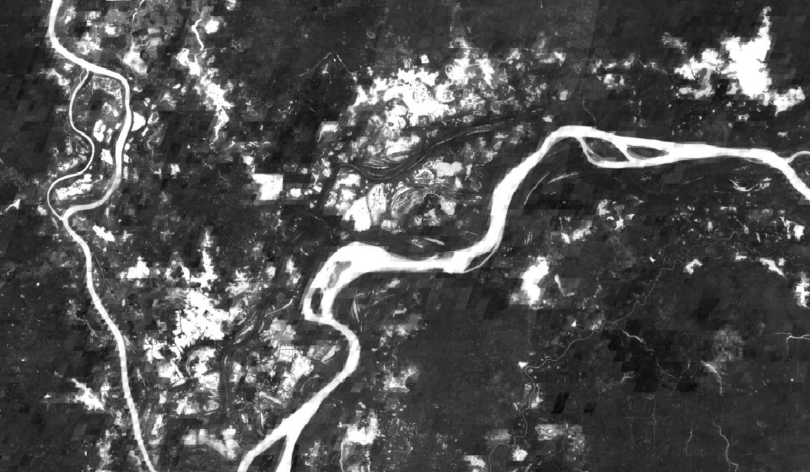

Workflows in the HYDRAFloods sense are related to high-level processes that chain together the lower-level functionality of the package. A defining feature of the workflows are that they are organized in a set of procedures (functions that return `None`) that kick off a steps, when chained together result in surface water maps. For example, a workflow can be creating daily surface water maps using a data fusion process.

Currently, only one workflow is implemented but it is possible to build more.

## Daily Surface Water Fusion Process (DSWFP)

The DSWFP is based on a few concepts: data fusion, predicting long-term trends in surface water, and refining surface water estimate with short-term trends. The whole process is split into three broad functions to achieve this goal:

 1. Export samples of coincident SAR-Optical acquisitions for data fusion
 2. Export long-term surface water dynamics using harmonic analysis
 3. Predict daily surface water by applying long-term harmonic prediction and correcting for short-term trends

 `hydrafloods` has implemented this workflow as a module that users can call functions for each step detailed above. First we need to import the neccesary packages:

```python
import ee
ee.Initialize()
import hydrafloods as hf

# import the DSWFP module
from hydrafloods.workflows import dswfp
```

### 1. Export SAR-Optical fusion samples

First step is to sample coincident SAR-Optical data so we can build a machine learning model to fuse the data. This process will kick off a Earth Engine export and result will be a feature collection with information.  Keep in mind that this process will take a little while to run (over 30 min) so go grab a cup of coffee while you wait ☕.

```python
# define a geographic region and time period
region = hf.country_bbox("Cambodia")
start_time = "2019-01-01"
end_time = "2019-07-01"

# define the asset name of the output
output_asset = (
    "users/<your_username>/fusion_sampling_"+
    f"{start_time.replace('-','')}_{end_time.replace('-','')}"
)

# run the sampling process
dswfp.export_fusion_samples(
    region,
    start_time,
    end_time,
    stratify_samples=True,
    output_asset_path=output_asset,
)
```

### 2. Export surface water harmonic coefficients

After we have exported our samples to fuse optical and SAR data we can run the process to export the surface water harmonic coefficients. This process takes the fusion samples creates a model to convert SAR data to a water index and then calculates changes in interannual surface water (based on the index). Again, this process can take a while depending on how large of an area and time period being processed, sometimes even days ⏳.

```python
region = hf.country_bbox("Cambodia")
start_time = "2015-01-01"
end_time = "2020-01-01"
input_features = ["VV","VH","ratio","ndpi"] # SAR features to predict water index
target_label = "mndwi" # water index to predict
fusion_fc = output_asset # the ouput asset name from the earlier block
ouput_asset = "users/<your_username>/surface_water_harmonic_coefficients

dswfp.export_surface_water_harmonics(
    region, 
    start_time, 
    end_time, 
    feature_names= input_features, 
    label= target_label, 
    fusion_samples= fusion_fc, 
    output_asset_path=None, 
    tile=False
)
```

### 3. Export daily water map

Now that we have our data exported and ready to use, we can begin predicting daily surface water maps. Here we provide a date that will want to estimate water for and this algorithm will estimate a water index based on the long-term harmonic trend while correcting that with recent observations. This kicks off two exports, one for the fused water index and another for the water map. The final water index is segmented using on of the [thresholding](/hydra-floods/thresholding/) algorithms.

```python
target_date = "2020-10-31"

dswfp.export_daily_surface_water(
    region, 
    target_date, 
    harmonic_coefs=None, 
    harmonic_collection=None, 
    feature_names=None, 
    label=None, 
    look_back=30, 
    output_confidence=True, 
    fusion_samples=None, 
    output_asset_path=None,
    initial_threshold=0.1,
    thresh_no_data=-0.1,
    tile=False
)
```
Example outputs from the DSWFP workflow highlighting the fusion product and estimated water as compared to and observed Sentinel 1 image.

 Sentinel 1 2019-12-04           | Fused product 2019-12-04        | Estimated Water 2019-12-04
:-------------------------------:|:-------------------------------:|:--------------------------------:
   |  | 